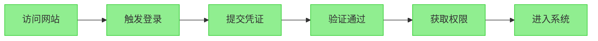

# 哔哩哔哩的登陆测试

## 1、登陆测试流程图

## 2、分析测试需求

哔哩哔哩的登录功能需要测试三个内容：

- 账号密码登录。
- 手机验证码登录。
- 第三方登录。

## 3、制定测试计划

| 软件版本 |                    哔哩哔哩APP 8.36.0版本                    |
| :------: | :----------------------------------------------------------: |
|  负责人  |                            戴龙星                            |
| 测试人员 |                            戴龙星                            |
| 测试时间 |                           2025.3.5                           |
| 测试用例 | PWD-01、PWD-02、PWD-03、PWD-04 SMS-01、SMS-02、SMS-03 OA-01、OA-02、OA-03 |
| 回归测试 |                           2025.3.5                           |

## 4、设计测试用例

- **账号密码登录**

  | 用例ID | 测试场景         | 测试步骤                                             | 预期结果                     |
  | :----- | :--------------- | :--------------------------------------------------- | :--------------------------- |
  | PWD-01 | 正确账号密码登录 | 1.输入已注册账号 2.输入正确密码 3.点击登录           | 跳转至个人中心页面           |
  | PWD-02 | 密码自动填充功能 | 1.进入登录页 2.点击密码输入框 3.选择浏览器保存的密码 | 自动填充账号密码且可成功登录 |
  | PWD-03 | 含特殊字符的账号 | 输入包含@#￥%的账号进行登录                          | 提示"账号格式不正确"         |
  | PWD-04 | 连续5次错误密码  | 使用错误密码连续提交5次                              | 账号锁定15分钟并提示         |

- **手机验证码登录**

  | 用例ID | 测试场景       | 测试步骤                                              | 预期结果                   |
  | :----- | :------------- | :---------------------------------------------------- | :------------------------- |
  | SMS-01 | 正常收码流程   | 1.输入正确手机号 2.点击获取验证码 3.1分钟内输入验证码 | 成功登录系统               |
  | SMS-02 | 验证码错误重试 | 1.输入错误验证码提交 2.重新获取新验证码               | 旧验证码失效，必须使用新码 |
  | SMS-03 | 超长手机号输入 | 输入20位数字的手机号                                  | 输入框限制为11位数字       |

* **第三方登录**

  | 用例ID | 测试场景           | 测试步骤                             | 预期结果               |
  | :----- | :----------------- | :----------------------------------- | :--------------------- |
  | OA-01  | 微信完整授权链     | 1.选择微信登录 2.扫码确认 3.同意授权 | 自动创建账号并登录     |
  | OA-02  | 取消QQ授权         | 在QQ授权页面点击取消                 | 返回登录页且无残留数据 |
  | OA-03  | 已绑定账号二次登录 | 使用已绑定的微博账号再次登录         | 直接跳转个人中心       |

## 5、测试执行

**测试结论**：所有测试用例通过，未发现功能缺陷